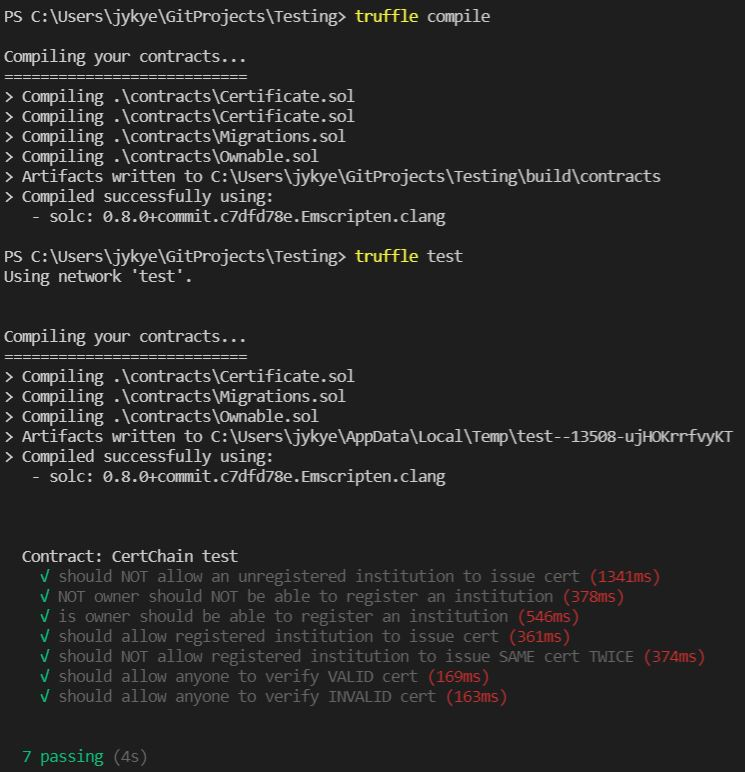

# Testing
## Requirements
Install NodeJS: https://nodejs.org/en/download/  
Install Truffle: `npm install -g truffle`  

## The Tests  
**√ should NOT allow an unregistered institution to issue cert**   
&nbsp; &nbsp; A unregistered address cannot issue certificates.   
**√ NOT owner should NOT be able to register an institution**      
&nbsp; &nbsp; Any other addresses, other than the (authority) address that deployed the contract, cannot register an (institution) address.   
**√ is owner should be able to register an institution**    
&nbsp; &nbsp; Only the (authority) address, that deployed the contract, can register an (insitution) address.  
**√ should allow registered institution to issue cert**          
&nbsp; &nbsp; Once the (authority) address registers an (institution) address, that (institution) address can now issue certificates.  
**√ should NOT allow registered institution to issue SAME cert TWICE**          
&nbsp; &nbsp; An registered (institution) address will not be able to issue the same certificate twice.     
**√ should allow anyone to verify VALID cert**   
&nbsp; &nbsp; Any address will be able to verify a certificate. If valid, returns True.  
**√ should allow anyone to verify INVALID cert**          
&nbsp; &nbsp; Any address will be able to verify a certificate. If invalid, returns False.  
**√ should allow only the recipient to see all his cert correctly**          
&nbsp; &nbsp; Gets all the certificate issued to the address that called the function.

## To Run
In this directory, run `truffle compile`.  
In this directory, run `truffle test` to run all tests.

## Output Log  
 
